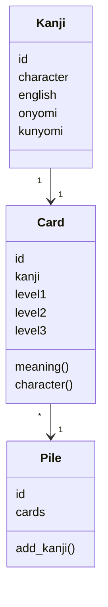
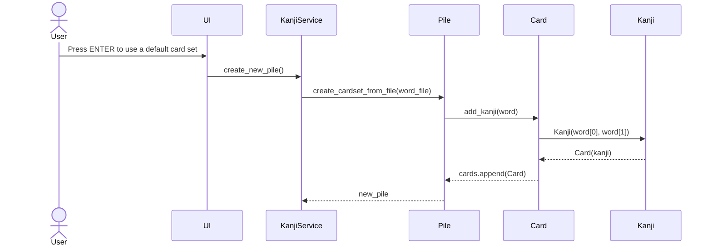

# Software Architecture Description 

## Structure

The structure of the program is built in a three-layer architecture, and the code is packaged as follows:

The 'UI' package contains code for the user interface, including classes for Learning display and Reviewing display. 'Services' package is for the application logic and 'Repositories' will contain the storage of data. The 'Entities' package contains classes representing the data objects used by the application, such as Pile (set of cards), Card and Kanji.

## User interface

The interface currently contains the following separate views:

* Learning the cards
* Reviewing the cards

(In addition, it will include also views for:

* Main page where user can navigate to learning, reviewing or loading new sets of kanji
* Display of the points and status of the learned cards
* Uploading own sets of kanji
)

Each of these is implemented as a separate class, controlled from the UI class, which is responsible for displaying the views, and it is completely isolated from the application logic. 

## Application logic

The data model of the application is formed by the classes Pile, Card and Kanji. 

Each Kanji-object holds attributes for the Japanese character, English meaning, and the different Japanese readings of the character, all of which also in three different writing systems (hiragana, katakana and romaji). 

The Card-object holds one Kanji, along with the information of the progress of the user with that particular kanji character (eg. how many times it has been reviewed correctly). Card-object also includes methods for returning required attributes of the card in question, for example the meaning or the character itself. 

The Pile-object holds sets of Cards, and it is contributing in creating the sets when data is read from the csv-files.

__

The functional entities are represented by the KanjiService class. The class provides methods different functions called in user interface.

Currently it provides the following:

* create_cardset_from_file(word_file)
* check_meaning(user_anwer, card)

## Main Functionalities

### Creating a set of cards from a .csv-file

### Learn View - Browsing through a set of cards

### Review View - Writing meaning to each card on a set

### Learning Status View - How many cards completed, how many on circle
