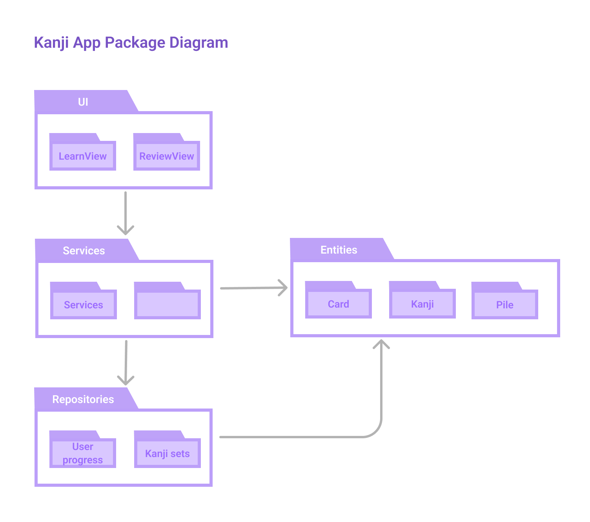
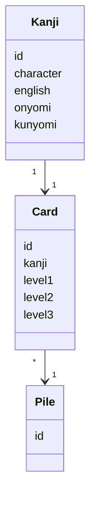
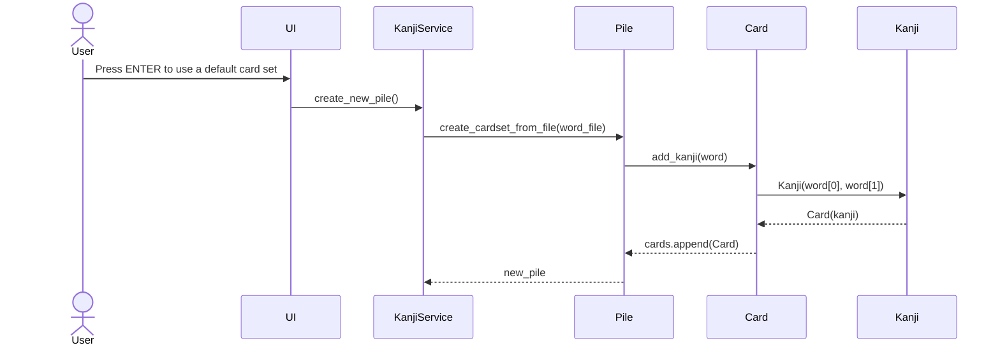

# Software Architecture Description 

## Structure

The package diagram for the current structure of the application 

## User interface

User interface is currently command line -based and it has a menu, offering two options for either displaying the Learn -view or Review -view. Both are separate classes called in UI-class. 

## Application logic

## Repositories

Coming up.

## Files 

Coming up. 

## Main Functionalities

### Creating a set of cards from a .csv-file

### Learn View - Browsing through a set of cards

### Review View - Writing meaning to each card on a set

### Learning Status View - How many cards completed, how many on circle
