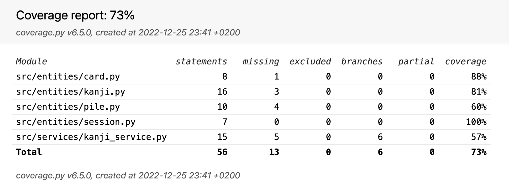

# Test documentation

The program has been tested by unit and integration tests, and by manual system-level tests.

## Unit and integration testing

### Application logic

The `KanjiService` class responsible of to the application logic is tested with the [TestKanjiService](https://github.com/johannalehto/ot-harjoitustyo/blob/main/kanji-app/src/tests/kanji_service_test.py) test class. The KanjiService-object utilizes injected dependencies, and for the test a stub class `CardStub` was created to provide mock entities for the service class.

### Entities

The classes responsible of holding the different entities are tested separately. 

### Test coverage

The application has a branch coverage of 73%, excluding the user interface layer.

## System testing

System testing of the application has been performed manually.

### Functionalities

All the functionalities listed in the [software specification](./software_specification.md) and in the [user manual](./user_manual.md) have been tested. 

## Quality issues remaining in the application

- Entities are not fully tested
- Application logic is not fully tested
- The application currently does not provide meaningful error messages in the situations such as user trying to input the Japanese reading to the review, when English is required

